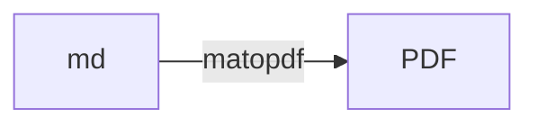
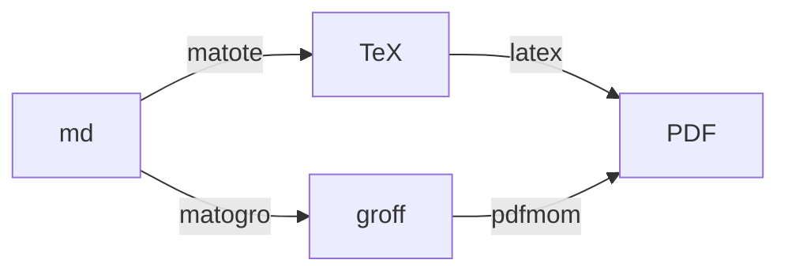
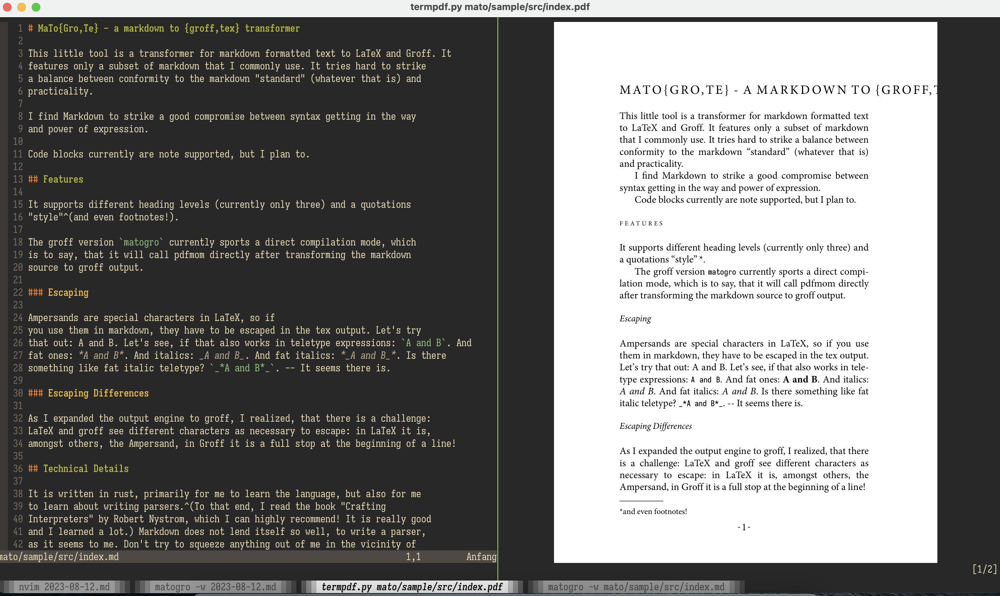
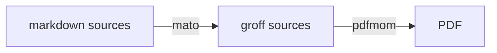

# MaToPDF - MArkdown TransfOrmer framework

With `matopdf`, you can transform markdown formatted text into PDFs,
and even more.



`matopdf` currently comprises a markdown parsing front-end part,
and two back-end renderers: one using LaTeX and one using `groff`.



Both work, but the `groff` back-end is better maintained.

And, more importantly, the `groff` back-end is much quicker. It
usually takes only around 1 second to process the input and produce
the resulting PDF.

The LaTeX back-end in comparison takes many times as much and is
heavily dependent on the selection ctan packages you include in your
preamble.

### Styling

The styling of the rendered PDF output (think of padding, fonts,
etc.) is configurable, depending on the back-end chosen.

The `groff` back-end has a default preamble
(see [here](mato/src/bin/default-preamble.mom)), which defines
standard styles. Settings therein can be overwritten by placing a
`preamble.mom` file next to your markdown file.


## Build and run

To test `matopdf`, the `groff` based transformer, use:

```
cargo run --bin matopdf sample/src/index.md
```

This will result in a file called `sample/src/index.pdf` with the
rendering, if all went well.

To test the LaTeX backend-based transformation, `matote`, use:

```
cargo run --bin matote sample/src/index.md
```

## Installation

Just use

```
cargo install --path .
```

to install `matopdf`, `matote` and `matofmt` and to your rust binary
directory.

## Watch mode

There is also a super-duper-watch-mode, which can be activated via
the `-w` flag. Then, the source file will be watched and if written
to will be reprocessed. This feature can be used to create a kind of
WYSIWYG experience when writing.



The processing and update time of the PDF is usually around and
below 1 second, so this is not instantaaneous, but good enough.

In the image above, I used [kitty](https://sw.kovidgoyal.net/kitty/)
and `termpdf.py` to display the PDF side by side with the markdown
source file.

There is a binary, `matoedit`, which creates a setup like the above
in a support terminal (wezterm, ATM) automatically.

## Developing

The implementation is done in rust, primarily for me to learn
the language. So, if you find any non-idiomatic stuff, feel
free to create a pull request.

Another facet of my motivation was the book ["Crafting
Interpreter"](https://craftinginterpreters.com) by Robert Nystrom.

To start reading the code, you might jump into one of the
binary sources, I'd recommend [src/bin/matopdf.rs](src/bin/matopdf.rs).

There, mato is used to create groff source code from markdown
markup and then `pdfmom`, a `groff`-based script, is used to
creat the final PDF:



The parser is located in [src/parser.rs](src/parser.rs).

# Author

Sven Schober <sv3sch@gmail.com>
