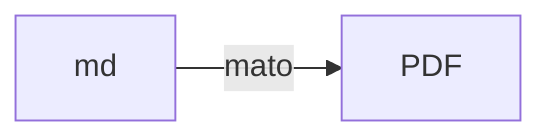
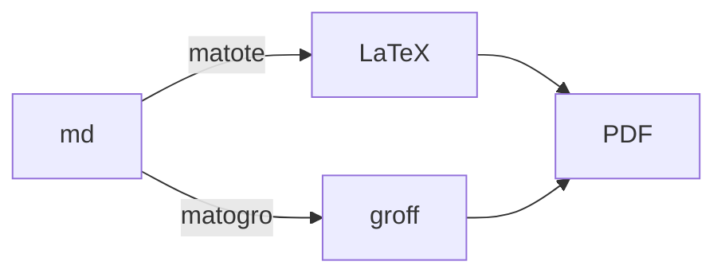

# MaTo - MArkdown TransfOrmer framework

Mato can transform markdown formatted text files into PDFs.



Mato currently comprises a markdown parsing front-end part, 
and two backend rederers: one using LaTeX and one using groff.



Both work, but the groff backend is more in use by me. But, more
importantly, the gorff backend is much quicker, it usually takes
only around 1 second to process the input and produce the resulting
PDF. The LaTeX backend in comparison takes many times as much and
is heavily dependent on the ctan packages you include in your
preamble.

To test `matogro`, the groff based transformer, use:

```
cargo run --bin matogro mato/sample/src/index.md
```

This will result in a file called `mato/sample/src/index.pdf` with the
rendering, if all went well.

To test the LaTeX backend-based transformation, `matote`, use:

```
cargo run --bin matote mato/sample/src/index.md
```

## Installation

Just use 

```
cargo install --path mato
```

to install `matote` and `matogro` to your rust binary directory.
 
## Watch mode

There is also a super-duper-watch-mode, which can activated via
`-w`. Then, the source file will be watched and if written to
will be reprocessed. This feature can be used to create a kind
of WYSIWYG experierence, when writing.


The processing and update time of the PDF is usually around and below 1 second, so this is not instantaaneous, but good enough.

In the image above, I use kitty and `termpdf.py` to display the
PDF side by side with the markdown source file.