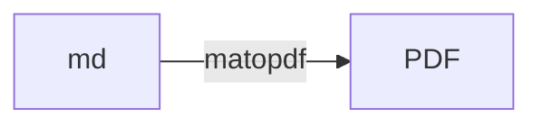
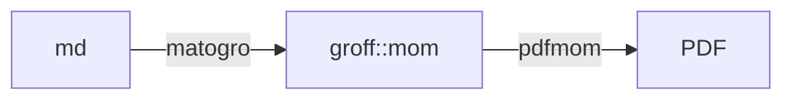
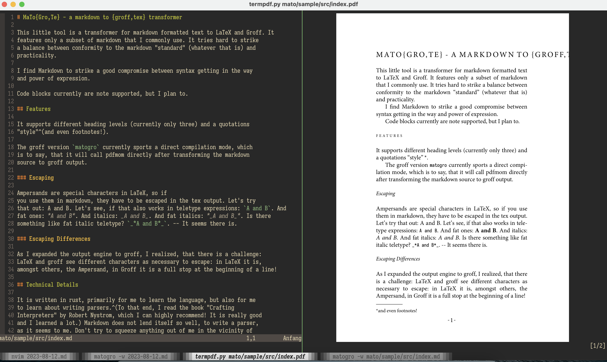
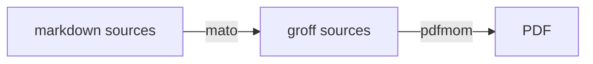
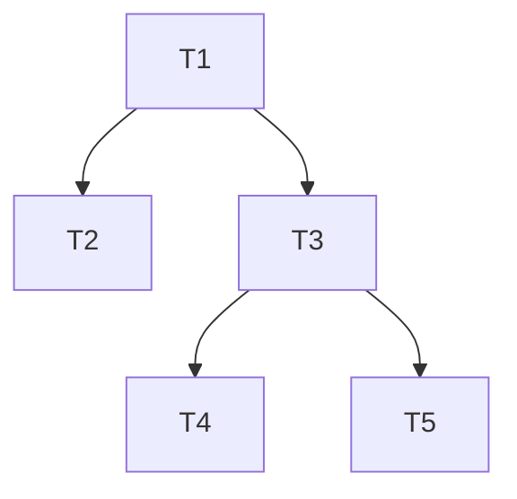
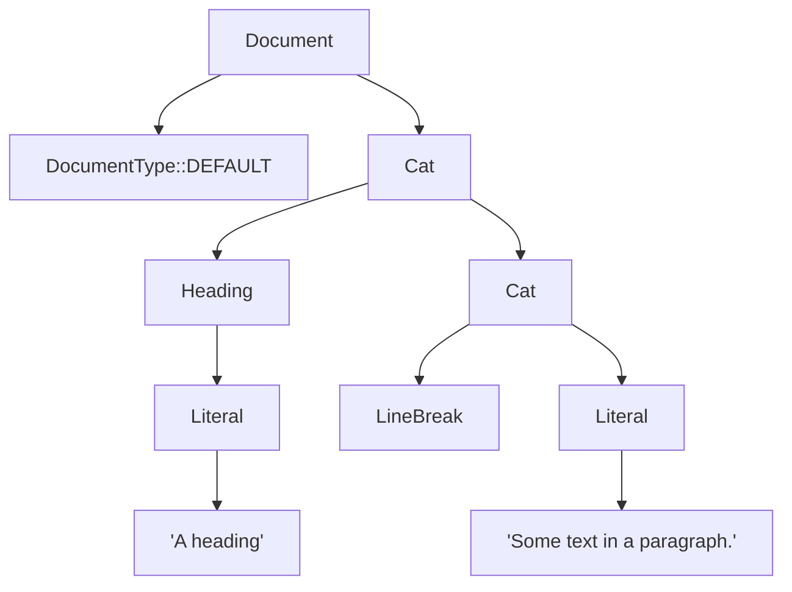

# MaToPDF - MArkdown TransfOrmer framework[^1]

[^1]:
    Actually, the acronym is somewhat of a historical mess. Originally, this tool
    started out as `matote`, which read "markdown to TeX". Then, I further evolutionized[^2]
    it into a framework, which could emit groff source code as well, so "framework" fit
    well in that case. Then, I dropped the TeX emitting part, thus "framework" no longer
    fits, but I am tired of renaming the thing in the meantime.

[^2]: Ah, is that even a word? I think, you get what I mean.


With `matopdf`, you can transform markdown formatted text into PDFs,
and even more.


```mermaid
graph LR
md -- matopdf --> PDF
```

`matopdf` currently comprises a markdown parsing front-end part,
and a back-end `groff::mom` renderer.


```mermaid
graph LR
md -- matogro --> groff::mom -- pdfmom --> PDF
```

The `groff::mom` back-end is quite fast: It
usually takes only around 1 second to process the input and produce
the resulting PDF.

### Styling

The styling of the rendered PDF output (think of padding, fonts,
etc.) is configurable, depending on the back-end chosen.

The `groff` back-end has a default preamble
(see [here](src/render/groff/default-preamble.mom)), which defines
standard styles. Settings therein can be overwritten by placing a
`preamble.mom` file next to your markdown file.

## Build and run

To test `matopdf`, the `groff` based transformer, use:

```
cargo run --bin matopdf samples/simple/minimal.md
```

This will result in a file called `samples/simple/minimal.pdf` with the
rendering, if all went well.

## Installation

Just use

```
cargo install --path .
```

to install `matopdf`, `matogro`, `matofmt`, `matoedit` and `matochk` to your
rust binary directory.

### Checking your installation

Run `matochk` to verify that `groff` is installed and that the required fonts
are available:

```
matochk
```

It checks for:
- `groff` on your `PATH`
- Required font families (Minion Pro and Iosevka Curly Slab) in groff's devpdf directories

If fonts are missing, run `mato-install-fonts.sh` to install them.

## Binaries

| Binary | Description |
|--------|-------------|
| `matopdf` | Transforms a markdown file into a PDF |
| `matogro` | Renders markdown to groff/mom source (stdout), similar to groff's `-T` interface |
| `matofmt` | Formats/normalises a markdown file |
| `matoedit` | WYSIWYG editing orchestrator — opens editor and live PDF preview side by side |
| `matochk` | Checks that groff and required fonts are installed |

## Image support

Images can be embedded in markdown using the standard syntax. JPEG and PDF images are
supported directly by the groff back-end via `.PDF_IMAGE`. SVG images are automatically
converted to PDF before embedding.

```markdown

```

See [`samples/images/`](samples/images/) for a working example.

## Watch mode

There is also a super-duper-watch mode, which can be activated via
the `-w` flag. If activated, the source file will be watched and if written
to will be reprocessed. The cool thing about the chosen solution is, that
this does not require polling, but the code is being signalled by the OS
of changes to files.

On Linux, this uses `inotify`. On macOS and FreeBSD, it uses kernel queues
(kqueue). If you are interested, take a look at [`src/watch.rs`](src/watch.rs).

### WYSIWYG Experience

The watch mode can be used to create a kind of WYSIWYG experience when writing.



The processing and update time of the PDF is usually around and
below 1 second, so this is not instantaneous, but good enough,
for me at least.

In the image above, I used [kitty](https://sw.kovidgoyal.net/kitty/)
and `termpdf.py` to display the PDF side by side with the markdown
source file.

There is a binary, `matoedit`, which creates a setup like the above
in a supported terminal (`wezterm` and `alacritty` at the moment)
automatically.

## Developing

The implementation is done in rust, primarily for me to learn
the language. So, if you find any non-idiomatic stuff, feel
free to create a pull request.

Another facet of my motivation was the book ["Crafting
Interpreters"](https://craftinginterpreters.com) by Robert Nystrom.

To start reading the code, you might jump into one of the
binary sources, I'd recommend [src/bin/matopdf.rs](src/bin/matopdf.rs).

There, mato is used to create groff source code from markdown
markup and then `pdfmom`, a `groff`-based script, is used to
create the final PDF:


```mermaid
graph LR
md["markdown sources"] -- mato --> groff["groff sources"] -- pdfmom --> PDF
```

### Parser

The parser is located in [`src/parser.rs`](src/parser.rs).

It is a recursive descent parser, which constructs an abstract
syntax tree of the form:


```mermaid
graph TD
T1 --> T2 & T3
T3 --> T4 & T5
```

More concretely, this means for the following markdown document:

```markdown
# A heading

Some text in a paragraph.
```

the parser constructs the following syntax tree:


```mermaid
graph TD
Document --> DocumentType::DEFAULT & Cat
Cat --> Heading & Cat1["Cat"]
Heading --> Literal1["Literal"] --> S1["'A heading'"]
Cat1 --> LineBreak & Literal
Literal --> S2["'Some text in a paragraph.'"]
```

The vocabulary of syntax nodes can be seen in [`src/syntax.rs`](src/syntax.rs).

The syntax tree can be dumped when setting the loglevel trace
with the `-t` command line option. Its textual representation is as follows:

```
Document(DEFAULT, Cat(Cat(Heading(Literal("A heading"), 0), LineBreak), Literal("Some text in a paragraph.")))
```

This is then rendered to the following groff/mom source:

```
... preamble omitted
.START
.SPACE -.7v
.FT B
.EW 2
.HEADING 1 "A heading"
.EW 0
.FT R
.DRH

Some text in a paragraph.
```

# Author

Sven Schober <sv3sch@gmail.com>
