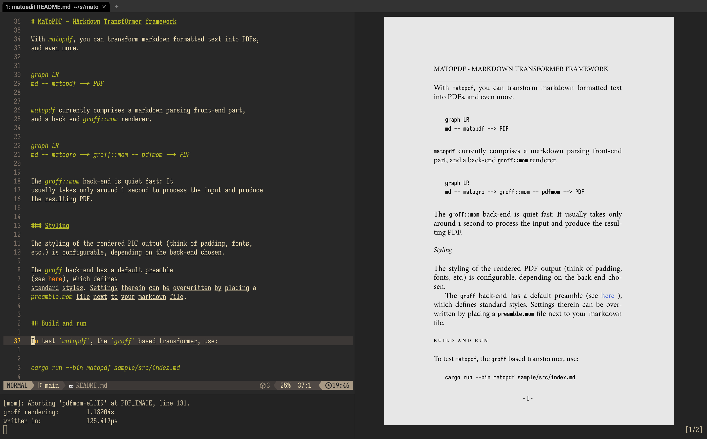

# MaToPDF - MArkdown TransfOrmer framework

With `matopdf`, you can transform markdown formatted text into PDFs,
and even more.


`matopdf` currently comprises a markdown parsing front-end part,
and a back-end `groff::mom` renderer.


The `groff::mom` back-end is quiet fast: It
usually takes only around 1 second to process the input and produce
the resulting PDF.


### Styling

The styling of the rendered PDF output (think of padding, fonts,
etc.) is configurable, depending on the back-end chosen.

The `groff` back-end has a default preamble
(see [here](src/render/groff/default-preamble.mom)), which defines
standard styles. Settings therein can be overwritten by placing a
`preamble.mom` file next to your markdown file.


## Build and run

To test `matopdf`, the `groff` based transformer, use:

```
cargo run --bin matopdf sample/src/index.md
```

This will result in a file called `sample/src/index.pdf` with the
rendering, if all went well.

## Installation

Just use

```
cargo install --path .
```

to install `matopdf`, `matote` and `matofmt` and to your rust binary
directory.

## Watch mode

There is also a super-duper-watch-mode, which can be activated via
the `-w` flag. Then, the source file will be watched and if written
to will be reprocessed. This feature can be used to create a kind of
WYSIWYG experience when writing.



The processing and update time of the PDF is usually around and
below 1 second, so this is not instantaaneous, but good enough.

In the image above, I used [kitty](https://sw.kovidgoyal.net/kitty/)
and `termpdf.py` to display the PDF side by side with the markdown
source file.

There is a binary, `matoedit`, which creates a setup like the above
in a support terminal (wezterm, ATM) automatically.

## Developing

The implementation is done in rust, primarily for me to learn
the language. So, if you find any non-idiomatic stuff, feel
free to create a pull request.

Another facet of my motivation was the book ["Crafting
Interpreters"](https://craftinginterpreters.com) by Robert Nystrom.

To start reading the code, you might jump into one of the
binary sources, I'd recommend [src/bin/matopdf.rs](src/bin/matopdf.rs).

There, mato is used to create groff source code from markdown
markup and then `pdfmom`, a `groff`-based script, is used to
creat the final PDF:


### Parser

The parser is located in [`src/parser.rs`](src/parser.rs).

It is a recursive descent parser, which constructs an abstract
syntax tree of the form:


More concretely, this means in the most simple form:


The vocabulary of syntax nodes can be seen in [`src/syntax.rs`](src/syntax.rs).

The syntax tree can be dumped when setting the loglevel trace
with the `-t` command line option. Its textual representation is as follows:

```
Document(DEFAULT, Cat(Cat(Heading(Literal("A heading"), 0), LineBreak), Literal("Some text in a pragraph.")))
```

This is then rendered to the following groff/mom source:

```
... preamble omitted
.START
.SPACE -.7v
.FT B
.EW 2
.HEADING 1 "A heading"
.EW 0
.FT R
.DRH

Some text in a pragraph.
```

# Author

Sven Schober <sv3sch@gmail.com>
