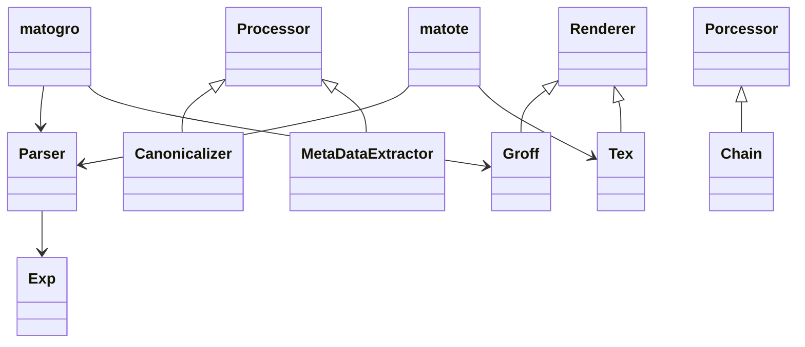

# Architecture

## Static Structure - Pipelining

At first, mato started out as a pipeline oriented system.
The source code would be read, passed through some filters
and during that filtering, the code is modified and finally
written out again by a backend, that does the rendering
into the target language.

That is why there were a LaTeX and a groff backend.

This is also very analogous to standard compiler layout.

Mato even has a intermediate format, the `Exp` tree.

It still follows that idea, but the backend is very much
focused on groff and some aspects of the target language
might have leaked into processing and parsing.

## Object orientation

I have a strong background in object orientation. As such, I
tend to think of problems in these terms. I explore the solution
space with a set of tools and intuitions that belong to that
realm.

With `rust` this creates a set of grievances:

- Lack of polymorphism - I am used to solve some problems,
  or most of them, probably, with polymorphism. Meaning,
  decoupling certain aspects of organisation from behaviour.
  Think of the pipeline example above: Parts of the pipeline
  need certain interface aspects to be able to fit them together.
  I see this as a case of an organizational problem. What each
  of these pipeline parts is doing is not important in this regard.

  In `mato` I tried to capture this notion with the terms `Process`
  and `Chain`. The first is something like a filter, or function on
  content which might select and modify the stuff it operates on.
  In this case this stuff is `Tree`s, `mato`s notion of an abstract
  syntax tree. To be able to implement or apply this process idea
  to rust language objects, I implemented it as a `trait`. This
  trait has a single method `process()` which maps a `Tree` to
  another `Tree`.

  I've created several processors: an _identity_ processor does nothing
  and simply returns the same `Tree` as it was given.

  A more elaborate processor is the `Canonicalizer`, which tries
  to simplify a `Tree`. This might need some explanation: As an
  artifact of parsing, suboptimal `Tree` structures result. At
  places there are `Empty` nodes, which result because a tree
  in `mato` is immutable and we can only add to it. This means
  at the beginning of some functions I initialize a result with
  an `Empty` node, but when some context fits, I add nodes using
  `Cat` nodes, which, like with `lisp` derivates, concatenates
  nodes and trees.

  The `Canonicalizer` now erases these superflous nodes, as they
  do not alter the rendering process in any way. This makes further
  processing more performant, as fewer nodes need to be processed.
  It also makes thinking about the trees more easy and straight
  forward.

  A `Chain` also implements `Process` interesstingly enough. It
  works in a functional way quite similar as `Cat` does for structure.
  If you call `process` on a `Chain` it first calls `process` on
  its first part and then passes the output again via `process` to
  its second part. That way, piplines can be constructed, as on the
  unix command line.

  The question could be asked, why bother recreating the pipelining
  mechanism in a programming language, that is readily available
  on the command-line already?

  The answer could be twofold: first, each pipeline process is just
  that, a process. This comes with considerable overhead. But, I
  think, this is a rather weak argument, as it might be a case of
  "premature optimization". The second answer is a stronger point
  in my opinion: On the unix command-line we loose all type information
  in between processes. Only strings can be passed along a pipeline.
  So, if we want to introspect into structural aspects of the conents
  being passed along, we need to reestablish this structure at each
  pipeline node. This is not only wastefull but also complicated and
  error prone. We could factor it out into common libraries, but I feel
  this goes against the loose coupling idea a bit and does not solve
  the problem, but only works around it.

  In a programming language, we can pass language-level objects
  along. No need to marshal and unmarshal objects between stages.
  We also construct an object graph, which guides program execution
  as opposed to independently operating processes. There is no buffering.
  We could construct actors with input queue, like in `go` with
  `go routines` and `channels`, but I chose not to do that in `mato`.

- Awkward dynamic dispatch - You could argue this is the same point.
  As the last one, or simply the other side of the same coin. But `rust`
  itself chose to provide `traits` but not make dynamic dispatch easy.
  Dynamic dispatch means, that you as a programmer need not know
  what kind of object is behind a pointer. Only the type decides, that
  you can call a method. Which method specifically is called is 
  dependent on the concrete object on which the method is called.

## Dynamic

## Static

